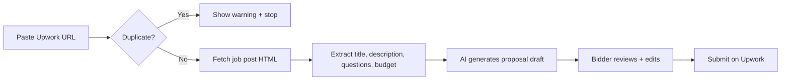

# Phase 2: AI Proposal Automation

This document outlines the planned Phase 2 features. **Not implemented yet.**

## Goals

1. **Instant duplicate check** (done in Phase 1)
2. **Auto-fetch job post** from Upwork URL after duplicate check passes
3. **AI proposal writer** using team instructions + portfolio context
4. **Portfolio-aware proposals** — pull relevant portfolio pieces per job type

## Planned flow

## Inputs needed from you

Before implementation, provide:

- `docs/PROPOSAL_INSTRUCTIONS.md` — tone, structure, do's/don'ts
- `docs/PORTFOLIO.md` or links — projects to reference by category
- Example winning proposals (optional, for few-shot prompts)

## Technical approach (draft)

| Piece | Option |
|-------|--------|
| Job scraping | Server-side fetch + parsing (Upwork ToS permitting) or manual paste fallback |
| AI | OpenAI / Anthropic API via server action |
| Storage | `bids.summary`, `bids.questions` auto-filled; `bids.proposal` AI draft |
| UI | "Generate proposal" button on bid detail page |

## Notes

- Upwork may block automated scraping — plan for **manual paste fallback**
- API keys will live in Vercel env vars (`OPENAI_API_KEY` etc.)
- AI output should always require human review before submit

## When ready

Share your MD instruction files and say "implement Phase 2" to start.
